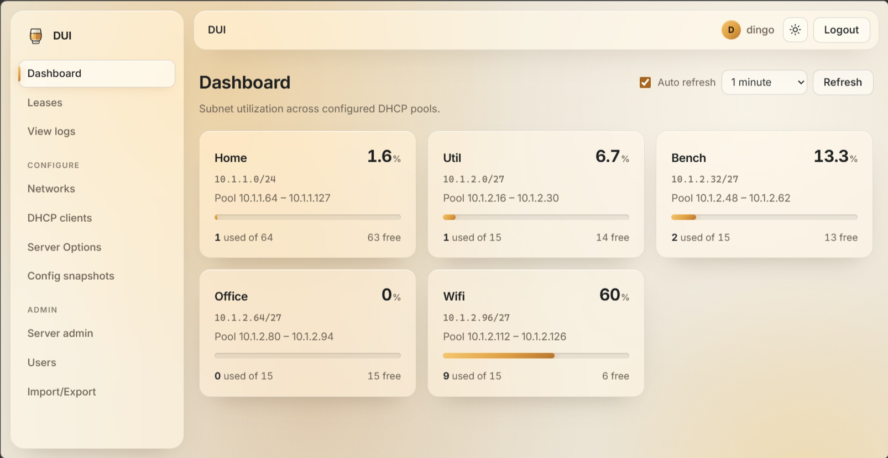

# DHCP UI (DUI)

DUI is a Dockerized home-network DHCP server with a web management interface. It runs ISC `dhcpd` and a FastAPI + React UI in a single Debian bookworm-slim container.



## Features

- Dashboard with per-subnet lease utilization
- Lease viewer grouped by subnet
- Live DHCP log viewer
- Configure networks, fixed clients, and global options
- Import/export the DHCP configuration as a zip
- Paste-import `dhcpd.conf`
- Config snapshots
- File-based user authentication with bcrypt hashes
- Server admin: manage users, control `dhcpd`, restart/stop container
- Syslog forwarding of lease changes, configuration changes, and user activity

## Quick start

1. Edit `docker-compose.yml` and set `DUI_INTERFACE` to your host network interface.

2. Build and start:

```bash
docker compose up -d --build
```

3. Get the one-time admin password from the first-start log, then sign in at `https://<host>:8067`. You'll be asked to choose your own password that meets the password policy (by default, 8+ characters).

```bash
docker compose logs dui | grep "DUI login"
```

The UI uses a self-signed certificate by default, so your browser will warn about it once. To avoid the warning, [use your own certificate](#using-your-own-certificate).

Lost the admin password? Issue a new one-time password:

```bash
docker compose exec dui python3 -m app.auth.cli reset-password admin
```

## Deployment notes

- Uses `network_mode: host` so DHCP broadcasts work on Linux.
- On Windows Docker Desktop, host networking behaves differently; build and run the stack on your Linux DHCP host for production use.
- Disable any existing DHCP server on your router or host before starting DUI.
- All persistent data is stored in the named Docker volume `dui-data` mounted at `/data`. Generated files stay in the volume, not on the host filesystem.
- DHCP logs (`/var/log/dui`) stay inside the container and are discarded when it is recreated.
- `users.yaml` is created on first start with a random one-time admin password, or from `DUI_ADMIN_PASSWORD` (must meet the password policy) if set. Later image rebuilds don't overwrite it. Remove `DUI_ADMIN_PASSWORD` from your compose file after the first start.
- Upgrading from an earlier release: accounts still using the old default password (`admin`/`dui`) must choose a new one at their next sign-in. The leases file moves to `/data/leases/`. On every start, `dhcpd.conf` is regenerated from validated settings, and any unsafe statements are removed and logged.

### Environment variables

| Variable | Default | Purpose |
| --- | --- | --- |
| `DUI_INTERFACE` | `eth0` | Interface dhcpd serves |
| `DUI_HTTP_PORT` | `8067` | Port for the web UI |
| `DUI_TLS` | `true` | Serve the UI over HTTPS. Setting it to `false` sends passwords unencrypted |
| `DUI_TLS_CERT` / `DUI_TLS_KEY` | self-signed in `/data/tls` | Your own certificate and key |
| `DUI_BIND_ADDRESS` | all addresses | Listen only on this address, such as a management IP |
| `DUI_ADMIN_PASSWORD` | random, printed once | First-start admin password |

### Using your own certificate

Mount the folder that holds your certificate and key into the container, then point `DUI_TLS_CERT` and `DUI_TLS_KEY` at the files' paths **inside the container**:

```yaml
    volumes:
      - dui-data:/data
      - /etc/ssl/dui:/certs:ro
    environment:
      DUI_TLS: "true"
      DUI_TLS_CERT: /certs/fullchain.pem
      DUI_TLS_KEY: /certs/privkey.pem
```

- Both files must be PEM. The key must not have a passphrase.
- The certificate file must contain the full chain: your server certificate followed by any intermediate certificates. With Let's Encrypt, use `fullchain.pem`, not `cert.pem`.
- Mount the files outside `/data`. On every start, the entrypoint re-owns `/data` for the API user. That would make a read-only mount fail at startup, and on a writable mount it would expose your key to the API user.
- The files only need to be readable by root.
- If either file is missing, the container stops with `DUI_TLS_CERT/DUI_TLS_KEY point to missing files` instead of falling back to the self-signed certificate.
- nginx reads the certificate only at startup. After you renew it, run `docker compose restart dui`.

Without these variables, DUI generates a self-signed certificate in `/data/tls` on first start and keeps reusing it. To create a new one (for example, after changing `DUI_SERVER_NAME`), delete `/data/tls` and restart the container.

## Syslog forwarding

DUI can send events to a remote syslog server. Admins turn it on and configure it under **Server admin → Syslog**. It is off by default. The settings are stored in `/data/syslog.yaml`.

- **Format:** RFC 5424, sent over UDP or TCP (TCP uses octet-counting framing, RFC 6587), with the `daemon` facility. The HOSTNAME field is the server's display name (set under **Server admin → Server**), with spaces turned into `-` and any non-ASCII characters dropped. There is no TLS, so send to a collector on a trusted network.
- **Categories** (each can be turned off):
  - *DHCP lease changes* (MSGID `LEASE`): leases granted (DHCPACK), released, declined, and refused (DHCPNAK). DUI reads these from dhcpd's log as they happen and doesn't replay older lines.
  - *Server changes* (MSGIDs `CONFIG`, `SNAPSHOT`, `SERVICE`, `SETTINGS`): subnet, fixed-client and option edits, imports, applies, snapshot restores and deletes, dhcpd and container start/stop/restart, the server name, the password policy, and the syslog settings themselves.
  - *User activity* (MSGIDs `AUTH`, `USER`): successful, failed and rate-limited sign-ins, sign-outs, password changes, and account creation, changes and deletion. Passwords are never sent.
- Messages carry structured data under `[dui@32473 ...]`, such as `user`, `ip`, `action`, `target`, `mac` and `hostname`.
- **Send test message** uses the settings currently in the form, even before you save them. With UDP, a successful test only means the packet was sent.
- Delivery is best effort. If the server is unreachable, messages are dropped (and a warning is logged) rather than slowing down the UI.

Quick check with a local listener:

```bash
nc -klu 5514        # then point DUI at <this host>:5514 over UDP
```

## Volume layout

```
/data/
  dhcpd.conf        generated from config.json
  config.json
  server.yaml
  users.yaml        bcrypt hashes (0600)
  session.secret    signs session cookies (0600)
  syslog.yaml       syslog forwarding settings (0600)
  leases/dhcpd.leases
  snapshots/
  tls/              self-signed certificate (root only)
```

Not persisted (container filesystem):

```
/var/log/dui/dhcpd.log
```

## Local development

Backend:

```bash
cd backend
pip install -r requirements.txt
set DUI_DATA_DIR=../data
set DUI_LOGS_DIR=../logs
mkdir ../data ../logs
python -m app.auth.cli init
uvicorn app.main:app --reload --app-dir .
```

Frontend:

```bash
cd frontend
npm install
npm run dev
```

### Translations

The UI uses [i18next](https://www.i18next.com/) with [react-i18next](https://react.i18next.com/). Each language has one JSON file, `frontend/src/locales/<code>/translation.json`, which covers both the UI text and the server's messages. English (`en`) is the source and the fallback for any missing text. The UI picks the browser's language when it's available, and the language picker (shown once more than one language is listed) remembers the user's choice.

To add a language:

1. Copy `frontend/src/locales/en/translation.json` to `frontend/src/locales/<code>/translation.json`, where `<code>` is a BCP 47 tag such as `de` or `pt-BR`, and translate the values. Leave `{{placeholders}}` and `<tags>` as they are. For plurals, use the [CLDR forms](https://www.i18next.com/translation-function/plurals) your language needs (`_one`, `_few`, `_many`, `_other`, ...).
2. Add `{ code: '<code>', name: '<native name>' }` to `frontend/src/i18n/languages.ts`.
3. Run `npm run i18n:check` (or `npm run i18n:check -- --strict` in CI). It lists missing or unknown keys, mismatched placeholders, and backend messages with no English text.

Right-to-left languages get `dir="rtl"` automatically. Dates and numbers follow the selected language.

Server messages: the API returns a stable `code` and `params` with each error, alongside the English `detail`, and the UI translates `server.<code>`. To add a server message, add its code and English template to `MESSAGES` in `backend/app/errors.py`, raise it with `AppError(code, ...)` (or `coded(code, ...)` inside validators), and add the English text under `server` in `locales/en`.

## Security

DUI controls the DHCP server for your whole network. Anyone who can change its settings can point every device at a malicious router or DNS server. Treat admin access accordingly.

- No default password. The first admin gets a random one-time password and must replace it.
- The UI is served over HTTPS, cookies are `Secure`, `HttpOnly` and `SameSite=Strict`, and nginx sends a strict Content-Security-Policy.
- Requests that change anything need a CSRF token and must come from the same origin. There's no CORS access.
- Sessions are checked against `users.yaml` on every request, so logout, password changes, role changes and deleted users take effect immediately.
- Logins are rate-limited per client IP and per username. Admins choose the password policy under **Server admin → Password policy**: a minimum length (8–72, default 8) and optional requirements for lowercase, uppercase, digits and symbols, and for not containing the username. It is stored in `/data/password_policy.yaml` and applies whenever a password is set; existing passwords keep working.
- Every field written to `dhcpd.conf` is validated, and imports are parsed and regenerated rather than written as-is. Statements that can run commands or read files (`on commit`, `execute`, `include`, `omapi-*`, `key` and similar) are rejected.
- Exports contain only the DHCP configuration (`dhcpd.conf`, `config.json`, `server.yaml`). Imports never replace users or the session secret. The exported zip still describes your network, so store it carefully.
- The API runs as an unprivileged `dui` user. dhcpd drops to a `dhcpd` user after binding its sockets. The container keeps only the capabilities it needs and sets `no-new-privileges`.
- The image build pins base images by digest, checks s6-overlay downloads against checksums, and installs Python packages from a hash-locked `backend/requirements.lock`.
- Recommended: put the UI on a management network (`DUI_BIND_ADDRESS`) instead of exposing it to every device on the LAN.

## License

MIT
