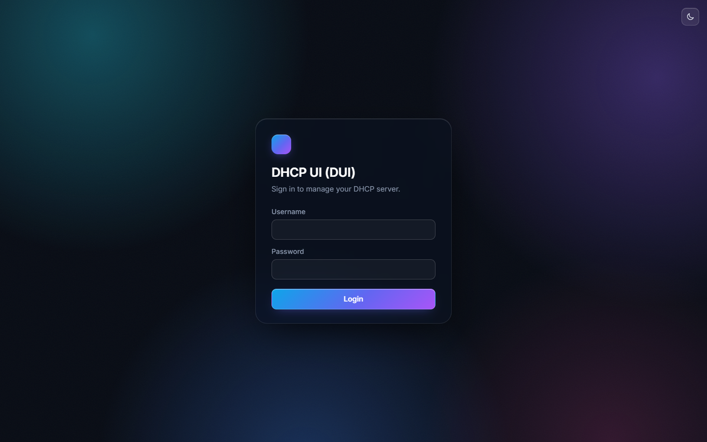

# DHCP UI (DUI)

DUI is a Dockerized home-network DHCP server with a web management interface. It runs ISC `dhcpd` and a FastAPI + React UI in a single Debian bookworm-slim container.



## Features

- Dashboard with per-subnet lease utilization
- Lease viewer grouped by subnet
- Live DHCP log viewer
- Configure networks, fixed clients, and global options
- Import/export the entire `/data` directory as a zip
- Paste-import `dhcpd.conf`
- Config snapshots
- File-based user authentication with bcrypt hashes
- Server admin: manage users, control `dhcpd`, restart/stop container

## Quick start

Default credentials on first install: `admin` / `dui` (change the credentials after logging in).

1. Edit `docker-compose.yml` and set `DUI_INTERFACE` to your host network interface.

2. Build and start:

```bash
docker compose up -d --build
```

3. Open the UI at `http://<host>:8067`

## Deployment notes

- Uses `network_mode: host` so DHCP broadcasts work on Linux.
- On Windows Docker Desktop, host networking behaves differently; build and run the stack on your Linux DHCP host for production use.
- Disable any existing DHCP server on your router or host before starting DUI.
- All persistent data is stored in the named Docker volume `dui-data` mounted at `/data`. Generated files stay in the volume, not on the host filesystem.
- DHCP logs (`/var/log/dui`) stay inside the container and are discarded when it is recreated.
- `users.yaml` is copied from the image template on first start. Later image rebuilds do not overwrite an existing volume file.

## Volume layout

```
/data/
  dhcpd.conf
  dhcpd.leases
  config.json
  users.yaml
  server.yaml
  session.secret
  snapshots/
```

Not persisted (container filesystem):

```
/var/log/dui/dhcpd.log
```

## Local development

Backend:

```bash
cd backend
pip install -r requirements.txt
set DUI_DATA_DIR=../data
set DUI_LOGS_DIR=../logs
mkdir ../data ../logs
uvicorn app.main:app --reload --app-dir .
```

Frontend:

```bash
cd frontend
npm install
npm run dev
```

## Security

- Passwords are stored as bcrypt hashes in `users.yaml`
- Sessions use signed HttpOnly cookies
- CSRF protection on mutating API requests
- Login rate limiting

## License

MIT
